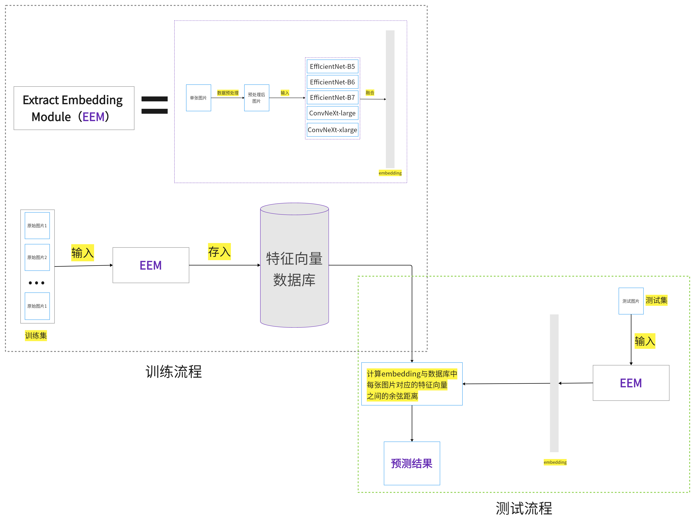

train代码解读:

https://hans0809.github.io/2022/05/07/%E9%B2%B8%E9%B1%BC%E5%92%8C%E6%B5%B7%E8%B1%9A%E8%AF%86%E5%88%AB%E7%AB%9E%E8%B5%9B%E8%A7%A3%E6%9E%90-%E8%AE%AD%E7%BB%83%E4%BB%A3%E7%A0%81/

infer代码解读: 

https://hans0809.github.io/2022/05/07/%E9%B2%B8%E9%B1%BC%E5%92%8C%E6%B5%B7%E8%B1%9A%E8%AF%86%E5%88%AB%E7%AB%9E%E8%B5%9B%E8%A7%A3%E6%9E%90-%E9%AA%8C%E8%AF%81%E5%92%8C%E9%A2%84%E6%B5%8B%E4%BB%A3%E7%A0%81/